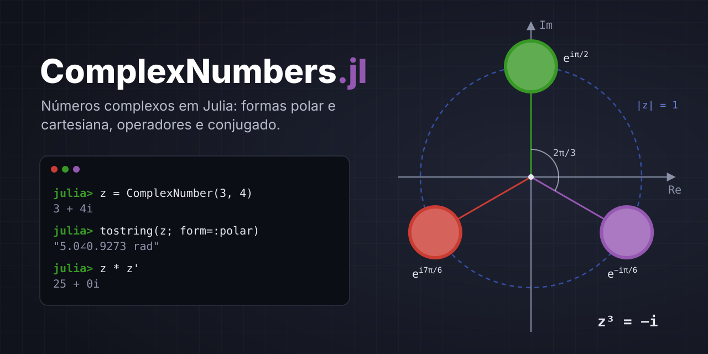

<div align="center">
    
</div>

Pacote Julia com uma implementação própria de números complexos, `ComplexNumber`, pensada para estudo e uso didático.

**Funcionalidades**

- Conversão da forma **polar → cartesiana** e **cartesiana → polar** (em radianos ou graus)
- Conversão para **string** nas formas cartesiana ou polar (equivalente ao `toString` do Java)
- **Sobrecarga dos operadores** `+`, `-`, `*`, `/` entre números complexos e números reais
- **Conjugado** com `conj(z)` ou com o operador pós-fixo `z'`
- **Interoperabilidade** com o `Complex` nativo do Julia (`z + 10im`, `im * z`, ...)

---

## Requisitos

- Julia **1.6** ou superior

## Instalação

### A partir do código local

Clone ou copie o projeto e registre-o no seu ambiente em modo de desenvolvimento:

```julia
julia> using Pkg
julia> Pkg.develop(path="/caminho/para/complextools")
```

Ou, no modo Pkg do REPL (tecle `]`):

```
pkg> dev /caminho/para/complextools
```

Outra opção é ativar o projeto diretamente na pasta dele:

```bash
cd complextools
julia --project=.
```

### A partir de um repositório git

Quando o pacote estiver publicado em um repositório (troque a URL pela real):

```julia
julia> using Pkg
julia> Pkg.add(url="https://github.com/<usuario>/ComplexNumbers.jl")
```

### Carregando o pacote

```julia
julia> using ComplexNumbers
```

### Dica: desenvolvimento com Revise.jl

O [Revise.jl](https://github.com/timholy/Revise.jl) recarrega o código automaticamente quando você salva um arquivo, sem precisar reiniciar o Julia. Ele **precisa ser carregado antes** do pacote:

```julia
julia> using Revise          # primeiro
julia> using ComplexNumbers  # depois
```

Se o pacote já tiver sido carregado antes do Revise, as alterações não serão acompanhadas, e será preciso reiniciar o REPL. Para nunca esquecer, adicione `using Revise` ao arquivo `~/.julia/config/startup.jl`.

> O Revise não consegue redefinir `struct`s. Se você mudar os campos de `ComplexNumber`, reinicie o Julia.

---

## Tutorial

### 1. Criando números complexos

Um `ComplexNumber` guarda a parte real (`re`) e a imaginária (`im`) na forma cartesiana `re + im·i`.

```julia
julia> z = ComplexNumber(3, 4)
3 + 4i

julia> ComplexNumber(2)            # só a parte real; a imaginária vira 0
2 + 0i

julia> ComplexNumber(1, 2.5)       # os tipos são promovidos automaticamente
1.0 + 2.5i

julia> typeof(ComplexNumber(1, 2.5))
ComplexNumber{Float64}

julia> real(z)
3

julia> imag(z)
4
```

### 2. Cartesiana → polar

Na forma polar, um número complexo é descrito pelo **módulo** `r = √(re² + im²)` e pelo **argumento** (ângulo) `θ`, sempre no intervalo (−π, π].

```julia
julia> modulus(z)
5.0

julia> argument(z)                 # em radianos
0.9272952180016122

julia> argument(z; degrees=true)   # em graus
53.13010235415598

julia> topolar(z)                  # tupla (r, θ)
(5.0, 0.9272952180016122)

julia> topolar(z; degrees=true)
(5.0, 53.13010235415598)
```

As funções `abs` e `angle` do Julia também funcionam:

```julia
julia> abs(z)
5.0

julia> angle(ComplexNumber(-1, 0))
3.141592653589793
```

### 3. Polar → cartesiana

`frompolar(r, θ)` cria um `ComplexNumber` a partir do módulo e do ângulo:

```julia
julia> frompolar(1, π/2)
0.0 + 1.0i

julia> frompolar(2, 30; degrees=true)
1.7321 + 1.0i
```

Ida e volta: converter para polar e depois de volta para cartesiana devolve o número original.

```julia
julia> frompolar(topolar(z)...)
3.0 + 4.0i
```

### 4. Convertendo para string

`tostring` é o equivalente ao `toString` do Java. Por padrão, ele usa a forma cartesiana e arredonda para 4 casas decimais.

```julia
julia> tostring(z)
"3 + 4i"

julia> tostring(ComplexNumber(3, -4))
"3 - 4i"

julia> tostring(ComplexNumber(1/3, 2/3))
"0.3333 + 0.6667i"

julia> tostring(ComplexNumber(1/3, 2/3); digits=2)
"0.33 + 0.67i"
```

Forma polar, em radianos ou graus:

```julia
julia> tostring(z; form=:polar)
"5.0∠0.9273 rad"

julia> tostring(z; form=:polar, degrees=true)
"5.0∠53.1301°"

julia> tostring(z; form=:polar, degrees=true, digits=1)
"5.0∠53.1°"
```

As funções padrão `string`, `print` e `println` usam a forma cartesiana:

```julia
julia> string(z)
"3 + 4i"

julia> print(z)
3 + 4i
```

Uma forma inválida gera um erro:

```julia
julia> tostring(z; form=:xyz)
ERROR: ArgumentError: forma inválida: :xyz; use :cartesian ou :polar
```

### 5. Operações aritméticas

Os operadores `+`, `-`, `*` e `/` funcionam entre dois `ComplexNumber`:

```julia
julia> a = ComplexNumber(1, 2)
1 + 2i

julia> b = ComplexNumber(3, 4)
3 + 4i

julia> a + b
4 + 6i

julia> a - b
-2 - 2i

julia> a * b
-5 + 10i

julia> a / b
0.44 + 0.08i

julia> -a                          # negação unária
-1 - 2i
```

Também funcionam com números reais, em qualquer ordem:

```julia
julia> a + 2
3 + 2i

julia> 10 - a
9 - 2i

julia> 3a                          # multiplicação implícita do Julia
3 + 6i

julia> a / 2
0.5 + 1.0i

julia> 1 / ComplexNumber(0, 1)     # 1/i = -i
0.0 - 1.0i
```

Para comparar resultados de ponto flutuante, prefira `≈` (`isapprox`, digite `\approx<TAB>`) a `==`:

```julia
julia> (a / b) * b ≈ a
true
```

Dividir por zero gera `DivideError`:

```julia
julia> a / ComplexNumber(0, 0)
ERROR: DivideError: integer division error

julia> a / 0
ERROR: DivideError: integer division error
```

### 6. Conjugado

O conjugado de `re + im·i` é `re − im·i`. Ele pode ser obtido com `conj` ou com o operador pós-fixo `'`:

```julia
julia> conj(z)
3 - 4i

julia> z'
3 - 4i

julia> (z')'                       # o conjugado do conjugado é o próprio número
3 + 4i
```

Propriedades clássicas:

```julia
julia> z * z'                      # z·z̄ = |z|²
25 + 0i

julia> z + z'                      # z + z̄ = 2·re
6 + 0i
```

### 7. Interoperabilidade com o `Complex` do Julia

O Julia já tem o tipo `Complex` (`3 + 4im`, `10im`, `im`). Ele pode ser misturado livremente com `ComplexNumber`, e o resultado é sempre um `ComplexNumber`:

```julia
julia> z + 10im
3 + 14i

julia> 10im + z
3 + 14i

julia> im * z                      # multiplicar por i gira 90°
-4 + 3i

julia> z / (1 + 1im)
3.5 + 0.5i

julia> z == 3 + 4im
true

julia> typeof(z + 1.5im)
ComplexNumber{Float64}
```

Conversões explícitas entre os dois tipos:

```julia
julia> ComplexNumber(5 - 2im)
5 - 2i

julia> Complex(z)
3 + 4im
```

### 8. Exemplo completo: circuito RLC em série

Neste exemplo, calculamos a impedância, a corrente e a potência complexa de um circuito com R = 100 Ω, L = 0,5 H e C = 100 µF, alimentado por 220 V a 60 Hz.

```julia
julia> R, L, C, ω = 100.0, 0.5, 1e-4, 2π * 60
(100.0, 0.5, 0.0001, 376.99111843077515)

julia> ZR = ComplexNumber(R)                 # resistor
100.0 + 0.0i

julia> ZL = ComplexNumber(0, ω * L)          # indutor:  jωL
0.0 + 188.4956i

julia> ZC = 1 / ComplexNumber(0, ω * C)      # capacitor: 1/(jωC)
0.0 - 26.5258i

julia> Z = ZR + ZL + ZC                      # impedância total
100.0 + 161.9697i

julia> tostring(Z; form=:polar, degrees=true, digits=2)
"190.35∠58.31°"

julia> V = frompolar(220, 0; degrees=true)   # tensão 220∠0°
220.0 + 0.0i

julia> I = V / Z                             # lei de Ohm
0.6072 - 0.9834i

julia> tostring(I; form=:polar, degrees=true, digits=3)
"1.156∠-58.309°"

julia> S = V * I'                            # potência complexa S = V·I*
133.5755 + 216.3519i

julia> tostring(S; digits=1)                 # P = 133,6 W, Q = 216,4 VAr
"133.6 + 216.4i"
```

---

## Referência da API

| Função / operador | Descrição |
|---|---|
| `ComplexNumber(re, im)` | Cria um número complexo `re + im·i` |
| `ComplexNumber(x)` | Cria um número complexo a partir de um real (`x + 0i`) ou de um `Complex` |
| `real(z)`, `imag(z)` | Partes real e imaginária |
| `modulus(z)`, `abs(z)` | Módulo `√(re² + im²)` |
| `argument(z; degrees=false)`, `angle(z)` | Argumento no intervalo (−π, π] |
| `topolar(z; degrees=false)` | Tupla `(r, θ)` |
| `frompolar(r, θ; degrees=false)` | Cria um `ComplexNumber` a partir da forma polar |
| `tostring(z; form=:cartesian, digits=4, degrees=false)` | String na forma `:cartesian` ou `:polar` |
| `string(z)`, `print(z)` | String na forma cartesiana |
| `+`, `-`, `*`, `/` | Aritmética com `ComplexNumber`, `Real` e `Complex` |
| `-z` | Negação |
| `==`, `≈` | Igualdade exata e aproximada |
| `conj(z)`, `z'` | Conjugado |
| `Complex(z)` | Converte para o `Complex` nativo do Julia |

## Rodando os testes

Na raiz do projeto:

```bash
julia --project=. -e 'using Pkg; Pkg.test()'
```

Ou, no REPL com o projeto ativo, para uma execução mais rápida durante o desenvolvimento:

```julia
julia> include("test/runtests.jl")
```

## Observação sobre o nome

O pacote se chama `ComplexNumbers`, mas a struct se chama `ComplexNumber` (no singular). Em Julia, um módulo não pode conter um tipo com o mesmo nome que ele.
